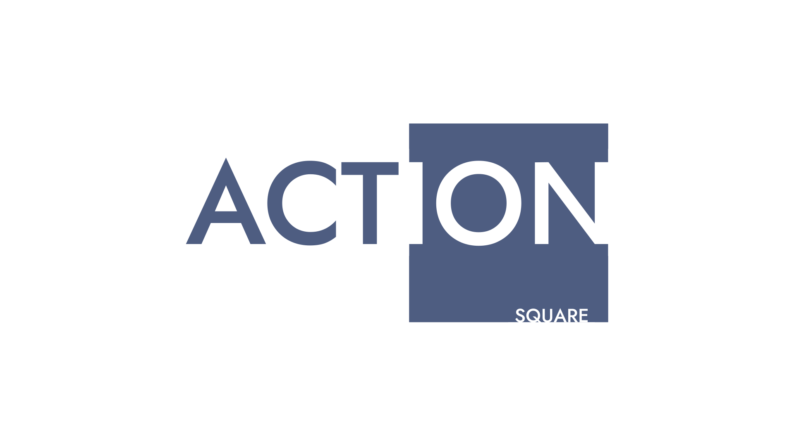

**Action Square** is a project created by [Augusto Goulart](https://github.com/oAGoulart) with focus in developing open-source software mainly for the purpose of activism and advocacy, making some technical aspects of it faster and more reliable.

As of right now, there are a few tools being developed, with one already released, check it below.

---

## Molde

A simple command line mail template generator and sender using **Sass** and **Markdown**. This tool can send customized mails using data from a single **JSON** file throught any mail provider.

Made using [Go](https://golang.org/), the official [Sass](https://sass-lang.com/install) command-line interface tool, and the [goldmark](https://github.com/yuin/goldmark) package.

<a class="button" href="https://github.com/action-square/molde">see more</a>

---

**&#169; 2021 Action Square**
